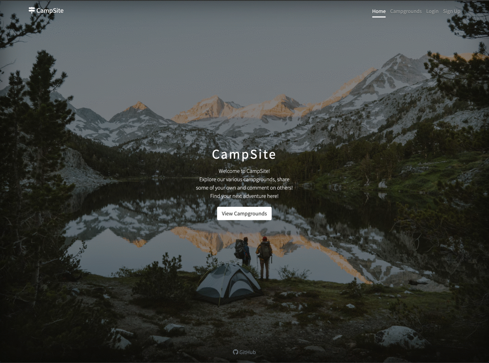

# CampSite

<!--  -->

### Deployed Website: https://camp-site-app.herokuapp.com

Created a full-stack CRUD webapp with a RESTful API that displays crowdsourced campground information and reviews.

Allows users to create accounts, create, view, edit, and remove campgrounds, upload images, and post and remove reviews.

Implemented authentication and authorization, sessions, cookies, flash messages, result pagination, and schema validation.

#### Built with:

- Node.js
- Express.js
- EJS
- MongoDB

#### Uses the following Libraries:

- Mongoose (for Object Data Modeling in MongoDB)
- Passport.js (for Authentication and Authorization)
- Joi (for Schema Validation)
- Connect-Flash (for Flash Messages)
- Express-Session (for Sessions & Cookies)
- Cloudinary (for Image Storage)
- Mapbox (for Cluster and Pinned Maps)
